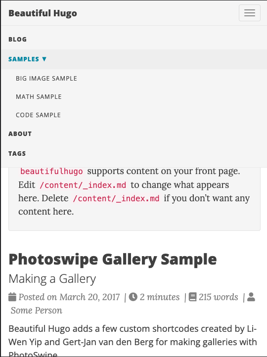

# Nitya Narasimhan's Blog

Experimenting with different platforms and themes to get a personal blog setup for use in sharing ongoing projects and interests. 

## Requirements

 - Minimal and clean appearance
 - Accessible by default, with fast build/deploy times
 - Support RSS feeds, tags, time-to-read and author profiles
 - Integrated social sharing, analytics and open-graph headers
 - Uses Markdown for content (with ease of migration if needed)
 - Deploys to GitHub Pages (now) & other hosting options (later)
 - Stable with good community support (themes, debugging etc.)

## Options

I'm currently exploring three different platforms:

> **1. [Docusaurus](https://docusaurus.io)**

Docusaurus is a React-based static site generation framework from Meta that I've ued in [multiple projects in 2022-2023](https://github.com/30DaysOf). I like it's easy of setup and customizability, and the option to create custom components (as a JS dev). But it is overkill for just a blog, and can be slow to build.


> **2. [Astro](https://docusaurus.io)**

Astro is another [rising star](https://risingstars.js.org/2022/en#section-ssg) for JS-based static site generators. It is designed for speed and works well with other frameworks (for components). I have a learning curve to understand it, but using it for a blog gives me a forcing function to learn by using it in a practical app.

> **3. [Hugo](https://gohugo.io)**

Hugo was my [original go-to](https://nitya.github.io/learn-playwright/) for blogs. It has long held the title of _fastest framework for building websites_. It is built with Golang - but as a user, you just configure it & author Markdown content. It also has the largest stable community with [many themes & templates](https://themes.gohugo.io/) to start building with.

_Regardless of the choice, my goal is to keep content in Markdown so I can migrate more easily to a different platform later if needed_.

## Beautiful Hugo Blog

This blog instance is built using the [Beautfiul Hugo](https://themes.gohugo.io/themes/beautifulhugo/) theme (and exploring option (3) above). In this section I'll document my setup instructions and any customizations made for reference.

> **Step 1:** [Quickstart | Install Hugo](https://gohugo.io/getting-started/quick-start/)

To install Hugo on macOS using Homebrew:

```bash
$ brew install hugo
```

You can check the installed version if useful:

```
$ hugo version
hugo v0.111.3+extended darwin/amd64 BuildDate=unknown
```

> **Step 2:** [Quickstart | Create New Site](https://gohugo.io/getting-started/quick-start/)

Use this command to scaffold a new Hugo website in the `website/` subfolder.

```bash
$ hugo new site website
```

Then add a theme in that directory. I used [Cupper](https://github.com/zwbetz-gh/cupper-hugo-theme) in the past, but it is now archived. I'm trying [Beautiful Hugo](https://github.com/halogenica/beautifulhugo) this time. The steps will be similar, just with the right theme.

```bash
$ cd website
$ git submodule add https://github.com/halogenica/beautifulhugo.git themes/beautifulhugo
```

> **Step 3:** [Quickstart | Configure Theme](https://gohugo.io/getting-started/quick-start/)

Update `config.toml` to use the theme. The default configuration has `baseURL, languageCode, title` defined  - update those, then add `theme`.
```bash
$ echo "theme = 'beautifulhugo'" >> config.toml

$ cat config.toml            
baseURL = 'http://blog.nitya.dev'
languageCode = 'en-us'
title = 'Connect The Dots'
theme = 'beautifulhugo'

```

> **Step 4:** [Quickstart | Preview Site](https://gohugo.io/getting-started/quick-start/)

Then test the theme locally  - the build is fast & dev server has hot reload.

```bash
$ hugo server

Start building sites … 
hugo v0.111.3+extended darwin/amd64 BuildDate=unknown

                   | EN   
-------------------+------
  Pages            |   7  
  Paginator pages  |   0  
  Non-page files   |   0  
  Static files     | 184  
  Processed images |   0  
  Aliases          |   1  
  Sitemaps         |   1  
  Cleaned          |   0  

Built in 44 ms
Watching for changes in <snip>/website/{archetypes,assets,content,data,layouts,static,themes}
Watching for config changes in <snip>/website/config.toml
Environment: "development"
Serving pages from memory
Running in Fast Render Mode. For full rebuilds on change: hugo server --disableFastRender
Web Server is available at http://localhost:1313/ (bind address 127.0.0.1)
Press Ctrl+C to stop
```
Opening the browser to that URL shows something like this. This is the barebones skeleton of the themed page.


> **Step 5:** [Quickstart | Preview example site](https://gohugo.io/getting-started/quick-start/)

Every theme comes with a default _exampleSite_ folder that has a pre-configured set of content folders and settings to give you a starting point for exploration and customization.

To _view_ that version, follow these commands from the `website/` folder. If you have your default preview server running already on port 1313, this will automatically launch the new preview on a _different port_ as shown below.

```bash
$ cd themes/beautifulhugo/exampleSite
$ hugo server --themesDir ../..
..
..
Running in Fast Render Mode. For full rebuilds on change: hugo server --disableFastRender
Web Server is available at http://localhost:51267/ (bind address 127.0.0.1)
Press Ctrl+C to stop
```

Opening that URL should show you something like this. The second image shows what the navigation menu options are, highlighting the ability to have multiple pages and routes beyond the basic blog.

| Landing Page (Blog)| Navigation Menu (routes)|
|:---|:---|
| | |
| | |

> **Step 6:** [Quickstart | Customize your site](https://gohugo.io/getting-started/quick-start/)

The quickest way for you to start with your own blog is to **copy the example site over, then customize it!**

```bash
$ cd website/
$ cp -r -iv themes/beautifulhugo/exampleSite/* . 

overwrite ./config.toml? (y/n [n]) y
themes/beautifulhugo/exampleSite/config.toml -> ./config.toml
themes/beautifulhugo/exampleSite/content -> ./content
themes/beautifulhugo/exampleSite/content/page -> ./content/page
..
..
themes/beautifulhugo/exampleSite/static/.gitkeep -> ./static/.gitkeep
```

_If you had your local dev server preview running from Step 4, then you should see that website update automatically_.

Try making the following changes:

 * Your previous `config.toml` was overwritten, so edit that and update the title, baseURL, description and other elements relevant to your site.
 * Create a `static/img` subfolder and add your own `favicon.ico` and `avatar-icon.png` files. By default, your subfolder versions will override the theme folder defaults.
 * Update the `_index.md` to customize the contents of the box on the landing page.
 * Update the `page/about.md` to reflect your identity.
 * Update the contents in the `post/` folder (e.g., change dates to current year)

