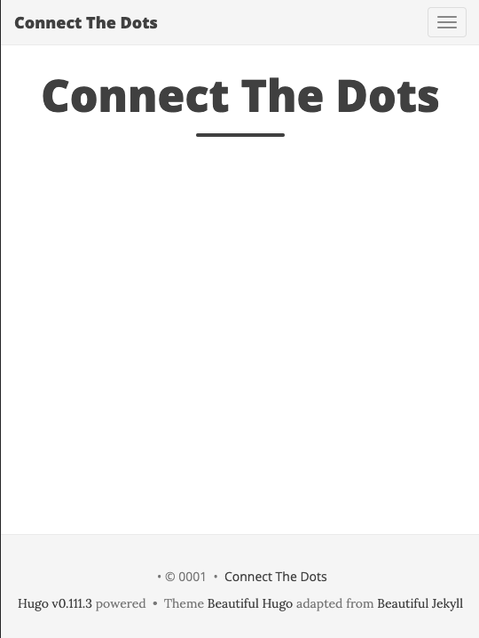
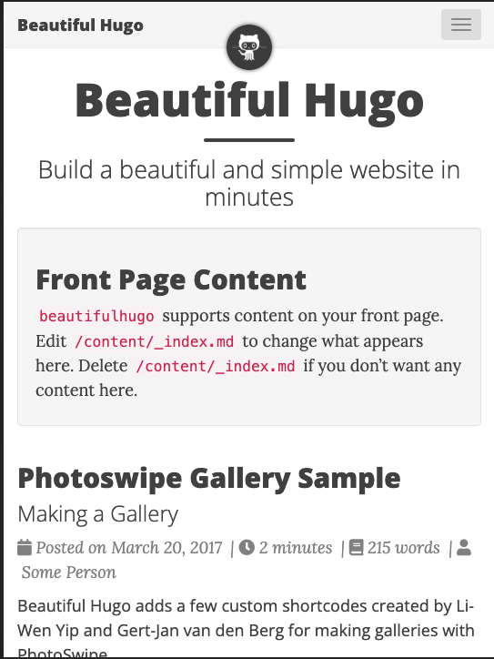
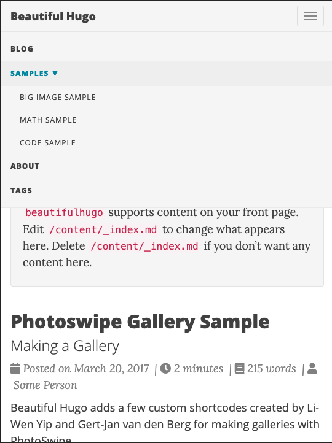

# Beautiful Hugo Blog

This blog instance is built using the [Beautfiul Hugo](https://themes.gohugo.io/themes/beautifulhugo/) theme (and exploring option (3) above). In this section I'll document my setup instructions and any customizations made for reference.

## 1. QUICKSTART

> 👉 **Step 1:** [Quickstart | Install Hugo](https://gohugo.io/getting-started/quick-start/)

To install Hugo on macOS using Homebrew:

```bash
$ brew install hugo
```

You can check the installed version if useful:

```
$ hugo version
hugo v0.111.3+extended darwin/amd64 BuildDate=unknown
```

> 👉 **Step 2:** [Quickstart | Create New Site](https://gohugo.io/getting-started/quick-start/)

Use this command to scaffold a new Hugo website in the `website/` subfolder.

```bash
$ hugo new site website
```

Then add a theme in that directory. I used [Cupper](https://github.com/zwbetz-gh/cupper-hugo-theme) in the past, but it is now archived. I'm trying [Beautiful Hugo](https://github.com/halogenica/beautifulhugo) this time. The steps will be similar, just with the right theme.

```bash
$ cd website
$ git submodule add https://github.com/halogenica/beautifulhugo.git themes/beautifulhugo
```

> 👉 **Step 3:** [Quickstart | Configure Theme](https://gohugo.io/getting-started/quick-start/)

Update `config.toml` to use the theme. The default configuration has `baseURL, languageCode, title` defined  - update those, then add `theme`.
```bash
$ echo "theme = 'beautifulhugo'" >> config.toml

$ cat config.toml            
baseURL = 'http://blog.nitya.dev'
languageCode = 'en-us'
title = 'Connect The Dots'
theme = 'beautifulhugo'

```

> 👉 **Step 4:** [Quickstart | Preview Site](https://gohugo.io/getting-started/quick-start/)

Then test the theme locally  - the build is fast & dev server has hot reload.

```bash
$ hugo server

Start building sites … 
hugo v0.111.3+extended darwin/amd64 BuildDate=unknown

                   | EN   
-------------------+------
  Pages            |   7  
  Paginator pages  |   0  
  Non-page files   |   0  
  Static files     | 184  
  Processed images |   0  
  Aliases          |   1  
  Sitemaps         |   1  
  Cleaned          |   0  

Built in 44 ms
Watching for changes in <snip>/website/{archetypes,assets,content,data,layouts,static,themes}
Watching for config changes in <snip>/website/config.toml
Environment: "development"
Serving pages from memory
Running in Fast Render Mode. For full rebuilds on change: hugo server --disableFastRender
Web Server is available at http://localhost:1313/ (bind address 127.0.0.1)
Press Ctrl+C to stop
```
Opening the browser to that URL shows something like this. This is the barebones skeleton of the themed page.




> 👉 **Step 5:** [Quickstart | Preview example site](https://gohugo.io/getting-started/quick-start/)

Every theme comes with a default _exampleSite_ folder that has a pre-configured set of content folders and settings to give you a starting point for exploration and customization.

To _view_ that version, follow these commands from the `website/` folder. If you have your default preview server running already on port 1313, this will automatically launch the new preview on a _different port_ as shown below.

```bash
$ cd themes/beautifulhugo/exampleSite
$ hugo server --themesDir ../..
..
..
Running in Fast Render Mode. For full rebuilds on change: hugo server --disableFastRender
Web Server is available at http://localhost:51267/ (bind address 127.0.0.1)
Press Ctrl+C to stop
```

Opening that URL should show you something like this. The second image shows what the navigation menu options are, highlighting the ability to have multiple pages and routes beyond the basic blog.

| Landing Page (Blog)| Navigation Menu (routes)|
|:---|:---|
| | |
| | |


## 2. CUSTOMIZATION

> 👉 **Step 6:** [Quickstart | Copy & Update Example Site](https://gohugo.io/getting-started/quick-start/)

The quickest way for you to start with your own blog is to **copy the example site over, then customize it!**

```bash
$ cd website/
$ cp -r -iv themes/beautifulhugo/exampleSite/* . 

overwrite ./config.toml? (y/n [n]) y
themes/beautifulhugo/exampleSite/config.toml -> ./config.toml
themes/beautifulhugo/exampleSite/content -> ./content
themes/beautifulhugo/exampleSite/content/page -> ./content/page
..
..
themes/beautifulhugo/exampleSite/static/.gitkeep -> ./static/.gitkeep
```

_If you had your local dev server preview running from Step 4, then you should see that website update automatically_.

Try making the following changes:

 * Your previous `config.toml` was overwritten, so edit that and update the title, baseURL, description and other elements relevant to your site.
 * Create a `static/img` subfolder and add your own `favicon.ico` and `avatar-icon.png` files. By default, your subfolder versions will override the theme folder defaults.
 * Update the `_index.md` to customize the contents of the box on the landing page.
 * Update the `page/about.md` to reflect your identity.
 * Update the contents in the `post/` folder (e.g., change dates to current year)


## 3. DEPLOYMENT

We need to have the static site build (for production) and then deployed to a relevant cloud hosting service, for public visibility and use. Hugo supports [multiple hosting options](https://gohugo.io/hosting-and-deployment/hosting-on-github/) out of the box. 

> 👉 **Step 7:** [Deploy & Automate | Host on GitHub Pages](https://gohugo.io/hosting-and-deployment/hosting-on-github/)

This project was already created in a GitHub repository. So we'll start with [Step 3](https://gohugo.io/hosting-and-deployment/hosting-on-github/#procedure) of the procedure outlined.

 * Visit the [Pages Settings](https://github.com/nitya/blog/settings/pages) for the repo, set the `Build and deployment` source to _"GitHub Actions"_.
 * Create a `.github/workflows/deploy-hugo.yml` file to define the GitHub Actions for this project.