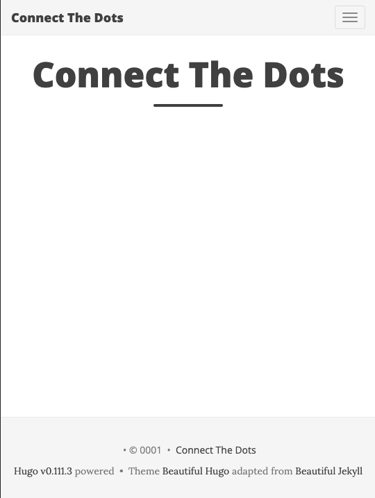
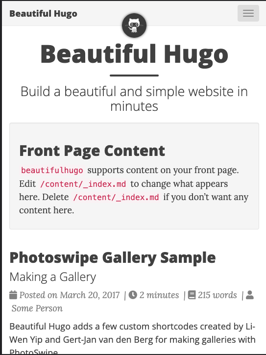

# Beautiful Hugo Blog

I decided to go with the [Beautfiul Hugo](https://themes.gohugo.io/themes/beautifulhugo/) theme and prioritized speed and stability over the new and shiny. Here is what I did to set the blog up, customize it, and deploy it to GitHub pages.


## 1. Setup Site

1. 👉🏽 Quickstart | [Install Hugo](https://gohugo.io/getting-started/quick-start/) 

    ```bash
    # Install on mac with Homebrew
    $ brew install hugo

    # Upgrade installed version with Homebrew
    $ brew upgrade hugo

    # Check installed version
    $ hugo version
    hugo v0.116.1-3e1ea030a5897addaf9d113d0826709fe07f77c0+extended darwin/amd64 BuildDate=2023-08-01T07:24:54Z VendorInfo=brew
    ```

2. 👉🏽 Quickstart | [Create New Site](https://gohugo.io/getting-started/quick-start/) 

    ```bash
    # Scaffold a new blog in the 'website/' folder
    hugo new site website

    # Add a new theme, following theme instructions
    # See: https://github.com/halogenica/beautifulhugo
    $ cd website
    $ git submodule add https://github.com/halogenica/beautifulhugo.git themes/beautifulhugo

    ## Set the theme in configuration
    $ echo "theme = 'beautifulhugo'" >> config.toml
    ```

3. 👉🏽 Quickstart | [Configure Site](https://gohugo.io/getting-started/quick-start/#configure-the-site) 

    ```bash
    # Update `config.toml` to suit the theme
    # Edit baseURL, languageCode, title and theme as needed
    # Here is what my settings look like
  
    $ cat config.toml            
    baseURL = 'http://blog.nitya.dev'
    languageCode = 'en-us'
    title = 'Connect The Dots'
    theme = 'beautifulhugo'
    ```

## 2. Preview Site

1. 👉🏽 Preview | [Default Theme Site](https://gohugo.io/getting-started/quick-start/#configure-the-site) 

    ```bash
    # Run the dev server
    $ hugo server
    Start building sites
    ...
    ...
    Web Server is available at http://localhost:1313/ (bind address 127.0.0.1)
    ``````
    Open the browser to that URL and you should see something like this. The server has hot reload so changing something (e.g., title) will automatically update the preview.

    


2. 👉🏽 Preview | [Example Theme Site](https://gohugo.io/getting-started/quick-start/#configure-the-site) 

    Themes come with `exampleSite/` folders that have pre-populated pages and settings to showcase what a "real" site would look like, and give you a better starting point for customization. You can view that version by doing the following. It should launch on the 1313 port if available, or automatically pick a different port if not.

    ```bash
    $ cd themes/beautifulhugo/exampleSite
    $ hugo server --themesDir ../..
    ..
    ..
    Running in Fast Render Mode. For full rebuilds on change: hugo server --disableFastRender
    Web Server is available at http://localhost:51267/ (bind address 127.0.0.1)
    Press Ctrl+C to stop
    ```
    You should now see something like this. At left is the defailt landing page, at right you see the expanded menu showing additional pages (routes) you can visit and customize.

    | Landing Page (Blog)| Navigation Menu (routes)|
    |:---|:---|
    | | |
    | | |


## 3.Customize Site

1. 👉🏽 Customize | [Copy Example](https://gohugo.io/getting-started/quick-start/)

    The easiest solution is to copy that default example and modify it to suit your needs. If your dev server is running, you should see the changes reflect instantly.

    ```bash
    $ cd website/
    $ cp -r -iv themes/beautifulhugo/exampleSite/* . 

    overwrite ./config.toml? (y/n [n]) y
    themes/beautifulhugo/exampleSite/config.toml -> ./config.toml
    themes/beautifulhugo/exampleSite/content -> ./content
    themes/beautifulhugo/exampleSite/content/page -> ./content/page
    ..
    ..
    themes/beautifulhugo/exampleSite/static/.gitkeep -> ./static/.gitkeep
    ```

2. 👉🏽 Customize | [Modify Example](https://gohugo.io/getting-started/quick-start/)

    Some changes that I found useful:
     - Create a `static/img` subfolder and add your own `favicon.ico` and `avatar-icon.png` files.
     - Update `_index.md` to customize the hero banner section on pages
     - Update the `page/about.md` to reflect your identity.
     - Update  `post/` folder contents (e.g., set dates to current year) 

## 4.Configure Site

1. 👉🏽 Customize | [ Update config.toml](https://themes.gohugo.io/themes/beautifulhugo/)

     - This overwrites the previous `config.toml` so update title, baseURL again
     - Update `paginate = X` to specify the default #posts to show on blog page (before paginating)
     - Uncomment `googleAnalytics = X` and set X to your Google Analytics tracking ID

2. 👉🏽 Customize | [ Other Changesl](https://themes.gohugo.io/themes/beautifulhugo/)

    - Update `_index.md` to modify the "banner" that gets pinned to all pages.
    - Google Search -  add site to [Programmable Search Engine](https://programmablesearchengine.google.com/), update `gcse` 
    - Add commit SHA to footer:  [update enableGitInfo, commit params](https://themes.gohugo.io/themes/beautifulhugo/#commit-sha-on-the-footer) as shown.
    - Edit `disclaimerText` in footer - to add Site Disclaimer.

3.  👉🏽 Customize | [Add New Social Icons](https://bas-man.dev/post/hugo/add-new-social-beautifulhugo/)
    - Default list can be updated in `config.toml`
    - Was missing _dev.to_ - the above linked post provides insights to fix it. Basically social icons are structured using `font-awesome` so
        - Copy`themes/beautifulhugo/data/beautifulhugo/social.toml` to `website/data/beautifulhugo/social.toml`
        - Modify your website copy to add in additional icons for "template"
        - Update the `config.toml` with your data to bind against this template.
      
4. 👉🏽 Customize | [Add Dark Mode Toggle](https://yonkov.github.io/post/add-dark-mode-toggle-to-hugo/)
    - 🚧 TODO: not yet implemented but post gives guidance
    - Requires an understanding of how Hugo themes and layout/partials are used.


## 5. Deploy Site

Build the static site for production, then use [supported hosting options](https://gohugo.io/hosting-and-deployment/hosting-on-github/) for deployment. 

1. 👉🏽 Deploy | [To GitHub Pages](https://gohugo.io/hosting-and-deployment/hosting-on-github/)
   - Follow [this procedure](https://gohugo.io/hosting-and-deployment/hosting-on-github/#procedure)
   - Set `GitHub Actions` as build-deploy source in [Pages Settings](https://github.com/nitya/blog/settings/pages)
   - Create a `.github/workflows/deploy-hugo.yml` to define GitHub Actions workflow
   - Verify that it has `working-directory` set to "./website"
   - Commit change to trigger rebuild - should deploy to [the GitHub Pages endpoint](https://nitya.github.io/blog/)

    _🎉 Success! Continue changing source and build/deploy will happen automatically on commits_.
1. 👉🏽 Deploy | Using Custom Domain
    - Follow [GitHub instructions](https://docs.github.com/pages/configuring-a-custom-domain-for-your-github-pages-site/managing-a-custom-domain-for-your-github-pages-site) to add relevant records to your DNS provider.
    - Update the 'Pages' Settings on your repo to add the Custom Domain.
    - Add a [CNAME file](https://docs.github.com/en/pages/configuring-a-custom-domain-for-your-github-pages-site/troubleshooting-custom-domains-and-github-pages#cname-errors) as a `website/static/CNAME` file for persistence on deploy

## 6. Update Content

  1. This theme has 2 [extra shortcodes](https://github.com/halogenica/beautifulhugo#extra-shortcodes):
    
      - Use HTML5 'details' for expand-fold capability on large sections

        ```bash
        
        This is the content (hidden until clicked).
        
        ```
      - Get `split` column effect (stacked on small, side-by-side on large screens)

        ```bash
        
        This is column 1.
        
        This is column 2.
        
        ```
  2. To [add new content](https://gohugo.io/getting-started/quick-start/#add-content) see quickstart below and [view help](https://gohugo.io/commands/hugo_new_content/#hugo-new-content) for full command options.
        ```bash
        # Create a new blog post with slug /my-first-post (is draft:true default)
        # Author content in HTML or Markdown
        # Use shortcodes, diagrams and frontmatter to improve quality, SEO
        hugo new posts/my-first-post.md

        # Build the site with drafts shown
        hugo server -D

        # Build the site with only published posts
        hugo server
        ```

## 7. Update Templates

Sometimes you might not like the default template for some part of the theme, or may want to customize it further. Hugo always checks for "overrides" in your instantiated folder before picking up "originals" from the themes subfolder - so I create a local copy and override that as needed.

Example:
 1. The default Beautiful Hugo template adds a _Last Modified_ metadata tag to each post in the post preview header, which can make it ugly.
 2. I checked the `themes/beautifulhugo/layouts` folder and found this was defined in the `partials/post_meta` template.
 3. I copied that over to `website/layouts/partials/post_meta` and commented out the relevant element. Rebuild the site - and presto! No more last-modified metadata.

    ```html
    <!--
    {{ if ne $datestr $lastmodstr }}
        &nbsp;{{ $lastmodstr | i18n "lastModified"  }}
    {{ end }}
    -->
    ```
 4. Next challenge: Add the last modified date to the top of each post instead so people get a sense for when that post was last modified. We follow the same procedure - except this time the template is the `_default/single.html` layout. Copy that over and make the changes (see the source under `website/layouts/_default/single.html`) for reference.

## 8. Hugo Syntax for Reference

  - [Directory Structure](https://gohugo.io/getting-started/directory-structure/) | [Configuration File](https://gohugo.io/getting-started/configuration/#configuration-file) | [`hugo` commands](https://gohugo.io/commands/)
  - [Frontmatter: Predefined](https://gohugo.io/content-management/front-matter/#predefined) variables on pages are standard
  - [Frontmatter: User-defined](https://gohugo.io/content-management/front-matter/#user-defined) variables are for you to use as needed
  - [Frontmatter: formats](https://gohugo.io/content-management/front-matter/#front-matter-formats) can be YAML, TOML or JSON - the first is most familiar.
  - [Content Management](https://gohugo.io/content-management/) covers diagrams, contetn formats, page bundles, shortcodes etc.
  - [Taxonomies](https://gohugo.io/content-management/taxonomies/) - user defined groupings of content (tags, categories)
  - [Summaries](https://gohugo.io/content-management/summaries/) - first 70 words of page (customizable) for use as teaser in templates
  - [Templates](https://gohugo.io/templates/) - HTML files with variables, functions. Page and list templates are key.
  - [Partials](https://gohugo.io/templates/partials/) - are context-aware reusable snippets for page and list templates
  - [Shortcodes](https://gohugo.io/content-management/shortcodes/) - snippets calling custom or built-in templates (use attribute-data binding)
      - [figure](https://gohugo.io/content-management/shortcodes/#figure) for images
      - [gist](https://gohugo.io/content-management/shortcodes/#gist) for gist
      - [highlight](https://gohugo.io/content-management/shortcodes/#highlight) for code samples
      - [instagram](https://gohugo.io/content-management/shortcodes/#instagram) embeds
      - [param](https://gohugo.io/content-management/shortcodes/#param) from page frontmatter (with fallback)
      - [rel and relref](https://gohugo.io/content-management/shortcodes/#ref-and-relref) for page's relative route or path in site
      - [tweet](https://gohugo.io/content-management/shortcodes/#tweet) for twitter post
      - [vimeo](https://gohugo.io/content-management/shortcodes/#vimeo) for video embed
      - [youtube](https://gohugo.io/content-management/shortcodes/#youtube) for youtube embed
      - **or** create [custom shortcodes](https://gohugo.io/templates/shortcode-templates/) yourself with a template.
  - [Hugo and GDPR](https://gohugo.io/about/hugo-and-gdpr/) - read to understand how to make site compliant.
  - Cookie Consent Bannner - look at community solutions like [this](https://hugocodex.org/add-ons/cookie-consent/) and [this](https://dev.to/basman/add-a-cookie-warning-notice-to-a-hugo-powered-site-4d34) 

Every page in Hugo has a [kind](https://gohugo.io/templates/section-templates/#page-kinds) attribute that reflects its purpose (home, page, section, term, taxonomy). A "List" template is used when there are multiple "content" item to be rendered as a group within a single page. The visual explains how this maps into page kinds.

<div  style="background-color:white; padding:10px;">
  
</div>

---

[👈🏽 Prev: Choose Blog Platform](./01-setup.md) 